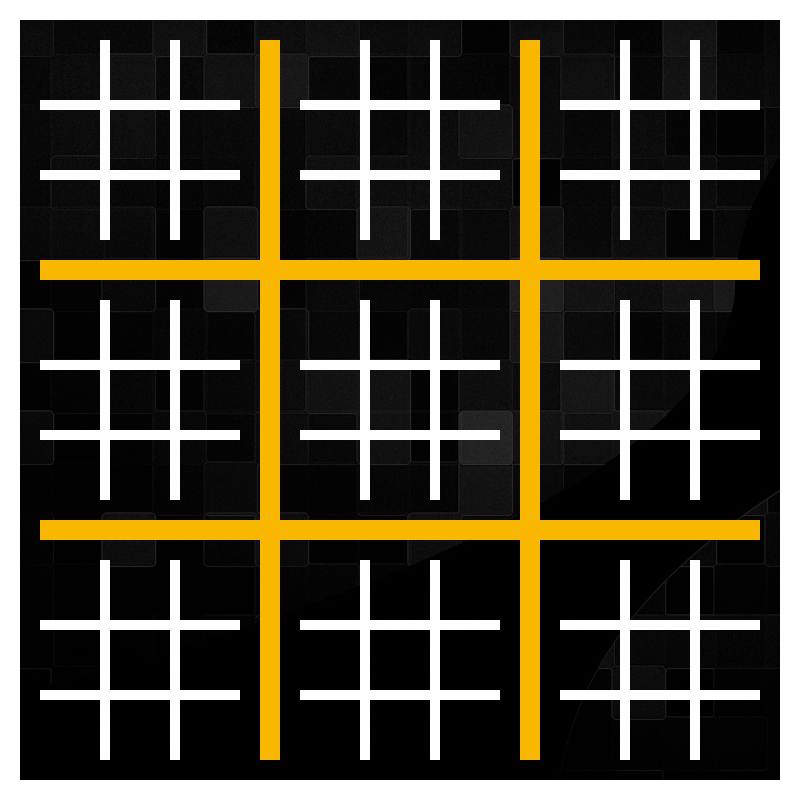
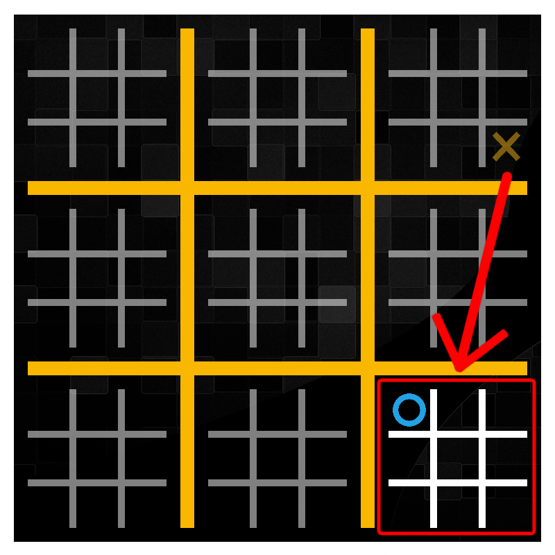
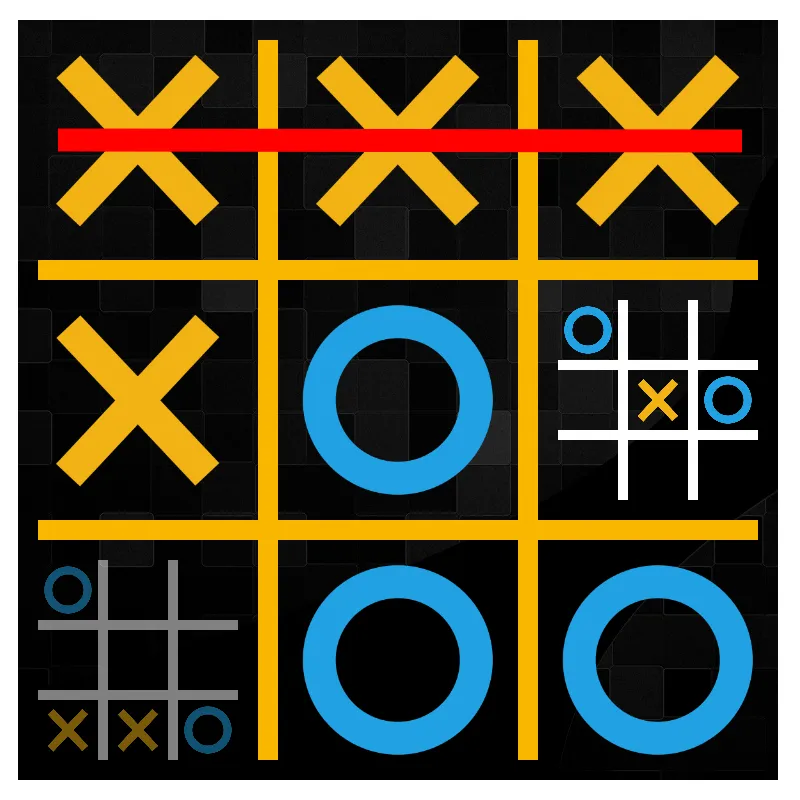
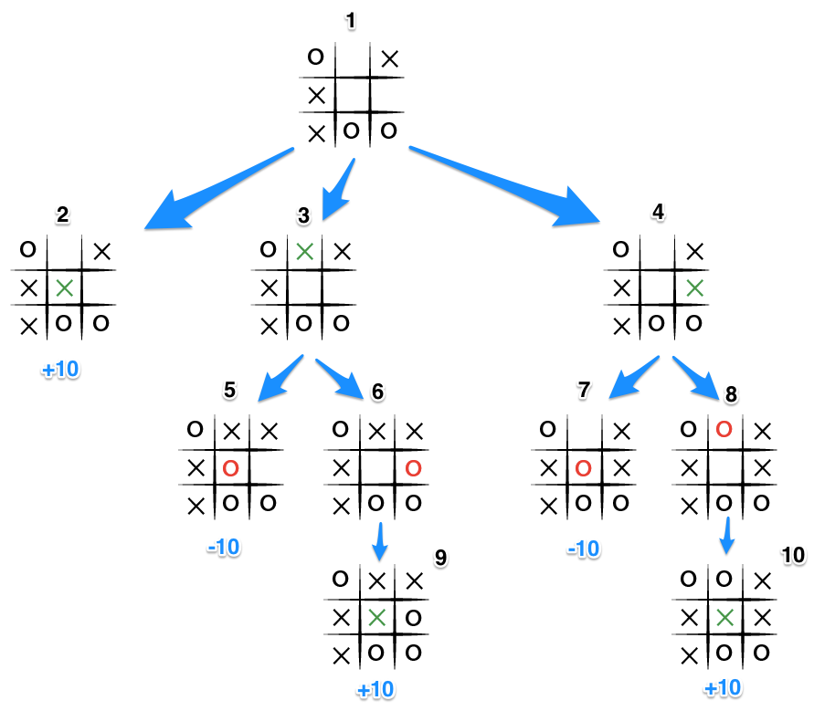
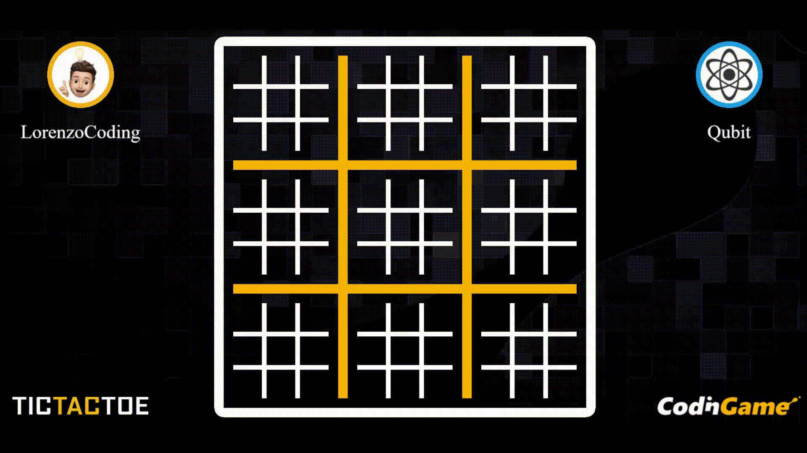
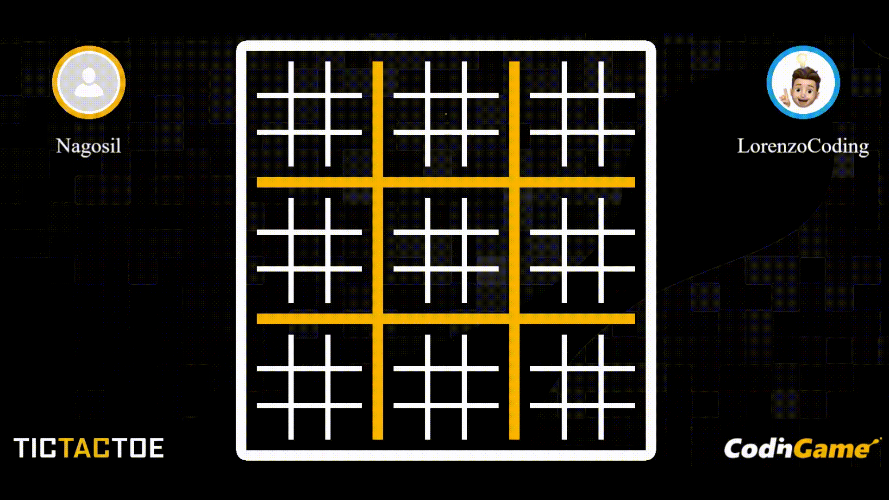

# ultimate-tic-tac-toe
The code implements a strategy for playing Ultimate Tic Tac Toe using the Minimax algorithm with Alpha-Beta pruning.
I designed it for the online [Bot Programming challenge by CodinGame](https://www.codingame.com/multiplayer/bot-programming/tic-tac-toe).

## Game rules
Ultimate Tic Tac Toe is an advanced variant of the classic game of Tic Tac Toe that adds an additional strategic dimension to the gameplay. The basic rules of Tic Tac Toe remain the same, but the game board is divided into 9 sub-boards, and players must try to win both on the sub-boards and the main board. 

A player's move determines which sub-board the next player must play in. The next player's move must be made in the corresponding sub-board indicated by the previous player's move.

If a player wins a sub-board, they claim that sub-board with their symbol (X or O). The sub-board is considered completed, and subsequent moves can be made in any open sub-board on the main board.

The objective is to win the game by either completing a line of three symbols (X or O) vertically, horizontally, or diagonally in a sub-board, or by winning three sub-boards in a row vertically, horizontally, or diagonally on the main board.

If a player is forced to play in a sub-board that has already been claimed or has already been completed, they can choose any open sub-board to play in.
The game continues until a player wins the overall game by completing the winning conditions mentioned above, or until all sub-boards and the main board are filled with symbols, resulting in a tie.

## AI Algorithm
The implemented [Minimax algorithm](https://en.wikipedia.org/wiki/Minimax) is a decision-making algorithm that allows the player to determine the best move to make based on the current game state. It evaluates all possible moves by recursively exploring the game tree, assigning scores to each node, and then backtracking to find the optimal move.

Here's how the Minimax algorithm works:
1. The algorithm considers the current state of the main board and the sub-boards and the player who is about to make a move
2. It recursively explores the game tree by considering all possible moves. It alternates between the maximizing player (ourself) and the minimizing player (opponent)
3. For each possible move, the algorithm assigns a score to the resulting game state. The score represents the desirability of that state for the maximizing player. In the case of Ultimate Tic Tac Toe, the scores can be assigned as follows:
    - If the maximizing player (automated player) wins in a sub-board, a high positive score is assigned
    - If the minimizing player (opponent) wins in a sub-board, a high negative score is assigned
    - If the game in a sub-board ends in a tie, a neutral score of 0 is assigned
    - If the game is not yet decided in a sub-board, the algorithm continues to explore deeper into the game tree
4. When reaches the specified depth limit or a terminal state, it assigns a score to that game state and propagates it back up the game tree
5. At each level of the game tree we select the move with the highest score for the maximizing player and the move with the lowest score for the minimizing player (opponent). This selection is based on the assumption that both players are playing optimally.

[Alpha-Beta pruning](https://en.wikipedia.org/wiki/Alpha%E2%80%93beta_pruning) is applied during the exploration of the game tree to eliminate unnecessary branches. It maintains two values, alpha and beta, to represent the best scores found so far for the maximizing and minimizing players, respectively. If a better move is found that guarantees a higher score for the maximizing player or a lower score for the minimizing player, the algorithm can prune the remaining branches under that node.

## Result
The AI implemented at the moment performs quite well, in fact I have reached the Silver League ✔️ of [CodinGame](https://codingame.com/). Below I show you some of the hundreds of games played.

### X Player

### O Player
